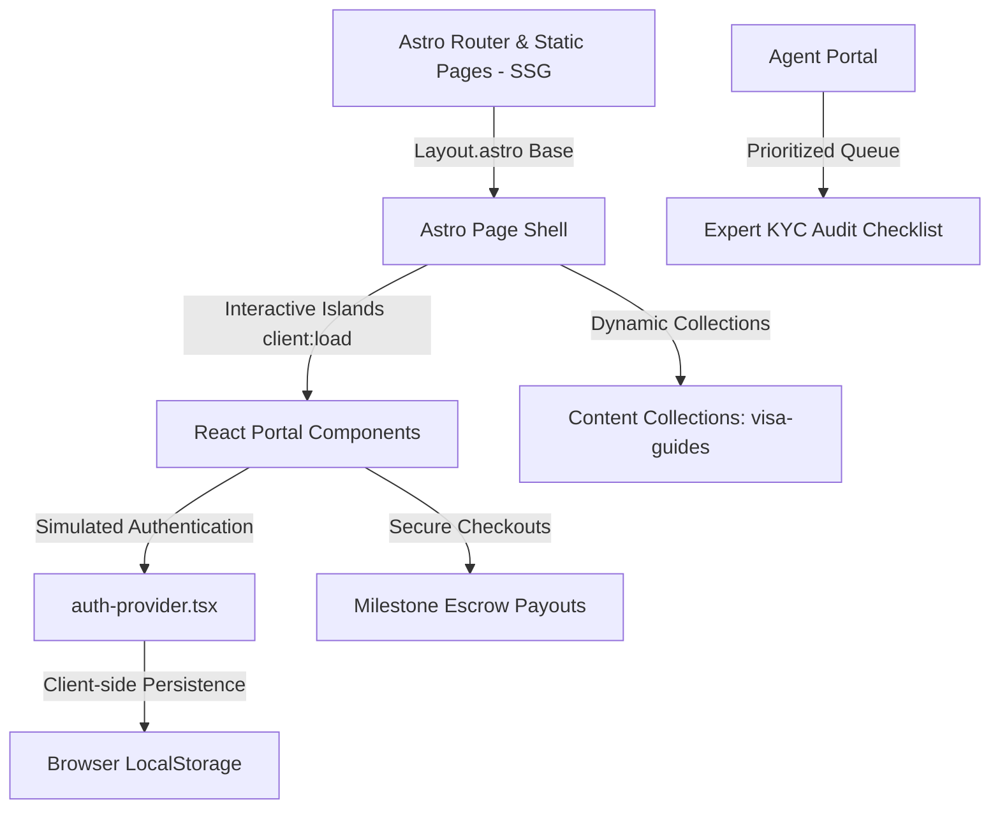

# TravlTik — Project Brain & Single Source of Truth

Welcome, Developer or AI Agent! This document serves as the absolute, fully reverse-engineered blueprint and single source of truth for the **TravlTik** codebase. It outlines the architecture, routing mechanics, database layer, mock states, security gates, dependencies, technical debt, and crucial operational workflows.

---

## 1. Project Overview & Business Value

**TravlTik** (often referred to as `visahub` or `visahub` in directory listings) is a premium, global immigration marketplace designed to bridge the gap between visa applicants (Seekers) and immigration experts, lawyers, study consultants, translation agencies, and supporting travel businesses.

### Core Value Propositions:
1. **Directory & Search Gating**: Applicants can query visa pathways, local consultants, and target countries. Search features require authentication, generating potential lead conversions.
2. **Interactive AI Digital Diplomat**: An automated eligibility assessment chat that evaluates applicant profiles (IELTS, education level) and recommends verified counsel.
3. **Escrow Protected Checkout**: Secure payments are locked in milestone-based escrow until consultation sessions or document filings are successfully delivered.
4. **Thin Astro Hybrid Engine**: Combining lightweight static layouts with high-performance React islands (`client:load`) for rich dashboards, wizards, and queues.
5. **Freelance verification agent program**: A self-contained portal where gig workers (Agents) register and perform manual KYC auditing on newly submitted listings in exchange for commissions.

---

## 2. Architecture & Technology Stack



### Core Frameworks & Dependencies:
- **Astro v4.16.6 (Hybrid Rendering Mode)**: Setup with `@astrojs/vercel` serverless adapter. Common directories are static (SSG), while checkout portals and dynamic pages utilize server-side rendering (SSR) via Vercel Edge functions.
- **React v18.3.1**: Hydrated selectively as islands (`client:load` or `client:idle`) to power complex multi-step forms, real-time filters, interactive dashboards, and simulated databases.
- **Tailwind CSS v3.4.1**: Implemented utility classes with custom animations (`tailwindcss-animate`). Global styles are customized in `src/styles/globals.css`.
- **Lucide React v0.446.0**: Main icon provider.
- **Firebase v10.12.0**: The system contains client configuration configurations for Firestore and storage initialization (`lib/firebase.ts`), but behaves in **Mock Mode** for developer simplicity if environment variables are not populated.

---

## 3. Directory Structure & File Inventory

```
visahub/
├── astro.config.mjs          # Astro integration configurations (React, Tailwind, Vercel Serverless)
├── package.json              # Direct dependencies & build scripts
├── postcss.config.mjs        # Style processors
├── replace-colors.js         # Color hex swap scripts (Legacy utility)
├── replace-yellow.js         # Styling overrides for star icons
├── tailwind.config.ts        # Tailwind class mappings & custom design palette
├── tsconfig.json             # TypeScript rules (Sets alias @/* to ./src/*)
├── components/               # LEGACY NEXT.JS FOLDER (Leftover backup - Unused)
│   ├── layout/               # Unused React layout wrappers
│   ├── shared/               # Unused shared drop-downs
│   └── ui/                   # Root UI elements (button.tsx, card.tsx)
└── src/                      # ACTIVE PROJECT SOURCE
    ├── assets/               # Local graphic assets
    ├── data/                 # SVG Path vectors for animations (e.g. clean_airplane.json)
    ├── content/              # Content collections configuration and markdown database
    │   ├── config.ts         # Zod schemas for visa-guides and success-stories collections
    │   └── visa-guides/      # Markdown data assets (e.g. canada-study-permit.md)
    ├── layouts/              # Astro global layout
    │   └── Layout.astro      # Injects preconnect fonts, SEO metadata, Header, Footer, and chat Fab
    ├── styles/               # CSS Design tokens
    │   └── globals.css       # Core HSL color variables and Yelp-inspired premium cards elevation
    ├── components/           # ACTIVE REACT & ASTRO COMPONENTS
    │   ├── Logo.astro        # Scalable Vector Logo
    │   ├── ExpertCard.tsx    # Card representation for legal professionals
    │   ├── JobCard.tsx       # Card representation for overseas jobs
    │   ├── TourCard.tsx      # Card representation for tour packages
    │   ├── UniversityCard.tsx# Card representation for top universities
    │   ├── layout/           # Astro navigation and footer layouts (Header.astro, Footer.astro)
    │   ├── providers/        # Client State Context
    │   │   └── auth-provider.tsx # Client-side simulated context manager (LocalStorage)
    │   ├── shared/           # Persistent widgets (EmergencyFab.astro, talk-to-us.tsx)
    │   └── interactive/      # Heavy React islands (Checkout portals, AI Diplomat, Seeker/Agent Wizards)
    └── pages/                # Astro page routing map (Direct urls mapping)
```

> [!WARNING]
> **Duplicate Directory Technical Debt**: The `/components` directory in the root is a legacy Next.js artifact. The active project ONLY imports components from `src/components`. Code symbols inside `/components` are not included in type compiling and must not be modified or referenced.

---

## 4. Routing & Page Manifest

Astro's file-based router translates paths under `src/pages/` directly to URLs. It operates in **Hybrid** mode: pages are statically built (SSG) unless explicitly designated as `export const prerender = false;` (SSR).

### Public Pages (SSG)
- `/` [index.astro](file:///c:/Users/DT/prashant%202/visahub/src/pages/index.astro): Homepage. Features a hero carousel, categories grid, recommended experts, and embeds the interactive `MagicSearch.tsx` and emergency callback hooks.
- `/about` [about.astro](file:///c:/Users/DT/prashant%202/visahub/src/pages/about.astro): Company values and team highlights.
- `/services` [services.astro](file:///c:/Users/DT/prashant%202/visahub/src/pages/services.astro): Directory listings of all visa services.
- `/success-stories` [success-stories.astro](file:///c:/Users/DT/prashant%202/visahub/src/pages/success-stories.astro): Reviews and match statistics.
- `/emergency` [emergency.astro](file:///c:/Users/DT/prashant%202/visahub/src/pages/emergency.astro): Quick restoration selector page for detentions or overstays.
- `/tours` [tours.astro](file:///c:/Users/DT/prashant%202/visahub/src/pages/tours.astro): Holiday, sport, and cruise packages catalog.
- `/jobs` [jobs.astro](file:///c:/Users/DT/prashant%202/visahub/src/pages/jobs.astro): Overseas job board.
- `/training` [training.astro](file:///c:/Users/DT/prashant%202/visahub/src/pages/training.astro): IELTS and language training directory.

### Dynamic Routing (SSG Pre-rendered)
- `/expert/[id]` [[id].astro](file:///c:/Users/DT/prashant%202/visahub/src/pages/expert/[id].astro): Dynamically generated at build-time using `getStaticPaths()`. Serves profiles for 6 mock experts (IDs 1-6).
- `/visa-guide/[country]/[type]` [[type].astro](file:///c:/Users/DT/prashant%202/visahub/src/pages/visa-guide/[country]/[type].astro): Builds pages from static lists merged with the `visa-guides` Content Collection (markdown documents).

### Dynamic Routing (SSR On-Demand)
- `/payment/[bookingId]` [[bookingId].astro](file:///c:/Users/DT/prashant%202/visahub/src/pages/payment/[bookingId].astro): Marked with `export const prerender = false`. Renders dynamic secure checkouts depending on URL parameters.

### Portal Wrappers (Aura Gated)
- `/dashboard` [dashboard.astro](file:///c:/Users/DT/prashant%202/visahub/src/pages/dashboard.astro): Mounts the `UserDashboard` React island.
- `/consultant/dashboard` [dashboard.astro](file:///c:/Users/DT/prashant%202/visahub/src/pages/consultant/dashboard.astro): Mounts the `ConsultantDashboard` React island.
- `/ai-assistant` [ai-assistant.astro](file:///c:/Users/DT/prashant%202/visahub/src/pages/ai-assistant.astro): Mounts the `AIAssistantPortal` React island.
- `/apply-visa` [apply-visa.astro](file:///c:/Users/DT/prashant%202/visahub/src/pages/apply-visa.astro): Mounts the `ApplyVisaPortal` React island.
- `/agents` [agents.astro](file:///c:/Users/DT/prashant%202/visahub/src/pages/agents.astro): Mounts the agent platform.

---

## 5. Critical System Workflows

### A. Authentication & localState Sync

```
[Login / Signup Form] ──> trigger signIn() ──> localStorage.setItem("visaformula_user", USER_JSON)
                                                         │
[Header.astro Script] <── listen for storage values ◄────┘
         │
         ├──> UI Updates: Swap "Log In" with "Dashboard"
         └──> UI Updates: Swap "Sign Up" with "Log Out" (Removes Storage & Redirects Home)
```

- **Authentication Guard**: In the `MagicSearch` component, any attempt to use the dropdowns or click the purpose chips checks for `visaformula_user` in `localStorage`. If missing, the event is stopped via `e.preventDefault()`, an alert `you must login for accessing the search option above` is shown, and the user is redirected to `/login`.
- **OTP Verification Gating**:
  - Seeker Registration: Requires a mock verification code **`999`** to progress past Step 1.
  - Expert Registration: Requires a mock verification code **`123456`** to progress past Step 1.

### B. Milestone Escrow Payments Flow

```
[Expert Profile / Apply Visa] 
            │
            ▼ (Redirect with parameters)
[payment/[bookingId]] (Secure SSR checkout mount)
            │
            ▼ (Secure Checkout Submission)
   Hold Funds in Escrow (simulated) ──> Status: "held"
            │
            ▼ (User satisfied with meeting/document check)
[User Dashboard / Escrow Portal] ──> Click "Confirm Delivery" ──> Release Funds (Status: "released")
            │
            └─────────────────────────> Click "Dispute" ──────────> Open Dispute (Flagged status)
```

1. **Checkout Surcharges**: Payment base fee includes a calculation of the expert fee, a platform fee, and optional additions (Express Processing at ₹1,500/traveler and rejection insurance at ₹699/traveler).
2. **Escrow Gating**: Once paid, payments are logged with a status of `held` in the user's dashboard ledger. Only when the seeker clicks "Confirm Delivery" are the funds marked as `released` and processed to the consultant's wallet.

### C. Freelance Agent KYC & Listing Audit Flow

```
[Agent Portal Registration] ──> Application Approved ──> Access Dashboard Queues
                                                                  │
[Checklist Checklist Auditing] <── View expert credentials, docs <┘
         │
         ├──> Action: Approve (Increments Agent Commission Balance)
         ├──> Action: Reject (Removes listing & flags system)
         └──> Action: Flag for Review / Skip
```

- **Earnings Structure**: Commission rates are hardcoded based on listing types:
  - Expert profile verification: ₹150
  - Tour package review: ₹80
  - Job listing verification: ₹50
  - Event listing verification: ₹100
  - Training institute verification: ₹120

---

## 6. Content Collections & Markdown Database

Collections are schemas configured under `src/content/config.ts` validated via Zod.

### Collections Manifest:
1. **`visa-guides`**:
   - **Fields**: `title` (string), `description` (string), `country` (string), `visaType` (string), `processingTime` (string), `fee` (string), `requirements` (array of strings), `seoKeywords` (array of strings), `publishedDate` (Date), `updatedDate` (Date, optional).
   - **Markdown Entries**: Located in `src/content/visa-guides/`. (e.g. [canada-study-permit.md](file:///c:/Users/DT/prashant%202/visahub/src/content/visa-guides/canada-study-permit.md), [usa-h1b.md](file:///c:/Users/DT/prashant%202/visahub/src/content/visa-guides/usa-h1b.md)).
2. **`success-stories`**:
   - **Fields**: `author` (string), `country` (string), `visaType` (string), `story` (string), `rating` (number), `publishedDate` (Date).

---

## 7. Known Risks, Bottlenecks, and Technical Debt

1. **Stale README & Template files**: The root [README.md](file:///c:/Users/DT/prashant%202/visahub/README.md) still describes a standard Next.js template bootstrap from Vercel instead of the hybrid Astro configuration.
2. **Legacy `/components` Folder**: Contains a copy of React components in the project root. This is legacy boilerplate and is **not referenced** by active routes. *Rule of thumb: Only edit components inside `src/components/`.*
3. **Simulated State Persistence**: While auth tokens are saved in `localStorage`, dynamic state items like dashboard active cases, inquiries, and newly uploaded documents are managed in local React memory (`useState`). They do not persist across hard browser reloads.
4. **Mocked Firebase Engine**: [lib/firebase.ts](file:///c:/Users/DT/prashant%202/visahub/lib/firebase.ts) runs in fallback mode since `.env.local` contains mock values (`dummy_key_for_dev`). Firebase calls are safe from throwing errors but do not push updates to a live backend database in development.
5. **Client-Side Gating**: Authentication controls on portals check the value of `visaformula_user` in `localStorage` directly in browser JavaScript. An experienced user can bypass this check by modifying local storage variables manually.

---

## 8. Development & Maintenance Guidelines

### Running the Project Locally
- Run dev server: `npm run dev` (running on port 3000 by default, check standard overrides)
- Build static bundle: `npm run build`
- Type checking: `npm run type-check`

### Rules for Modifying Theme/Styles
The styling tokens are stored as HSL variables in `src/styles/globals.css`. Do not write hardcoded hex values in tailwind classes. Use primary/secondary design variables instead.
- **Deep Navy (Primary)**: `var(--primary)` / HSL `222 76% 24%`
- **Cyan/Teal (Secondary/Accent)**: `var(--secondary)` / HSL `195 57% 48%`
- **Montserrat Font Family**: Applied globally to bodies, titles, and button CTAs.

---

This finishes the absolute system analysis for **VisaFormula Hub**. Use this brain file as your guide to modify, run, or extend this application without breaking underlying logic pipelines.
